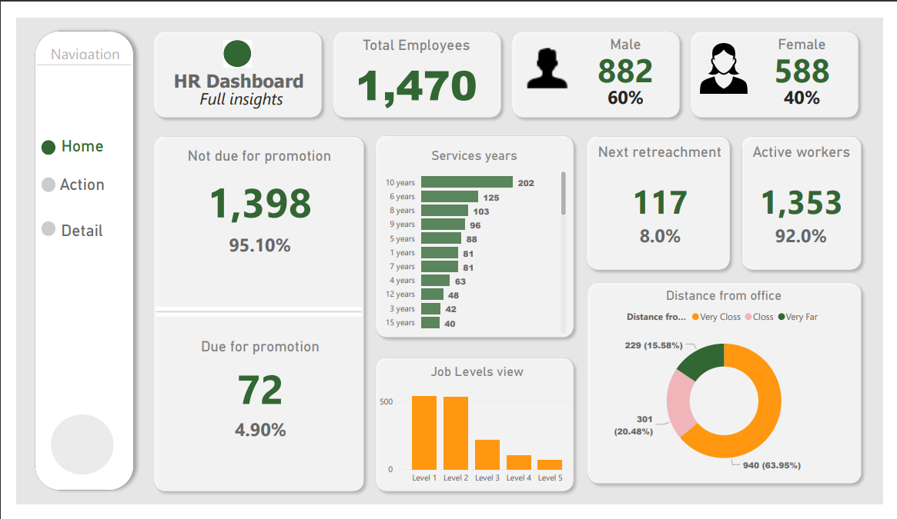

# Power BI HR Dashboard

## Overview

This Power BI HR Dashboard is designed to provide insights into various HR-related metrics and actions that require attention. The dashboard is divided into three main pages: "Home," "Action," and "Details."

### Page 1: Home

The "Home" page offers an overview of key HR metrics, as well as quick access to action items. Here are the components on this page:

- **Total Employees:** Total number of employees in the organization.
- **Male:** Number of male employees.
- **Female:** Number of female employees.
- **Not Due for Promotion:** Employees who are not due for promotion.
- **Not Due for Retrenchment:** Employees who are not due for retrenchment.
- **Service Years:** Distribution of employees by their years of service.
- **Next Retrenchment:** Employees who are next in line for retrenchment.
- **Active Workers:** The number of actively employed workers.
- **Job Levels View:** A visualization of the organization's job levels.
- **Distance from Office:** Distance of employees' residences from the office.

### Page 2: Action

The "Action" page contains two tables that display employees who require specific actions:

- **Employees Due for Retrenchment:**

  - Employee Name
  - Due for Retrenchment Date
- **Employees Due for Promotion:**

  - Employee Name
  - Due for Promotion Date

These tables help HR personnel identify employees who either need to be promoted or retired.

### Page 3: Details

The "Details" page offers a more detailed view of the organization's HR metrics and trends, broken down by various categories:

- **Due for Promotion and Due for Retrenchment by Department:** A visualization showing the number of employees due for promotion and retrenchment by department.
- **Total Employees by Job Satisfaction:** A chart displaying the total number of employees based on their job satisfaction ratings.
- **Employees by Overtime:** A visualization that shows the distribution of employees based on their overtime work.
- **High Rating vs. Low Rating:** A comparison of high and low ratings among employees.
- **Job Role Overview:**
  - Total Employees
  - Due for Promotion
  - Due for Retrenchment
  - A table that provides insights into different job roles within the organization.

This HR dashboard provides HR professionals and management with a comprehensive view of the organization's workforce and highlights areas that need attention, such as promotions and retrenchments. It is a powerful tool for data-driven decision-making and HR management.

